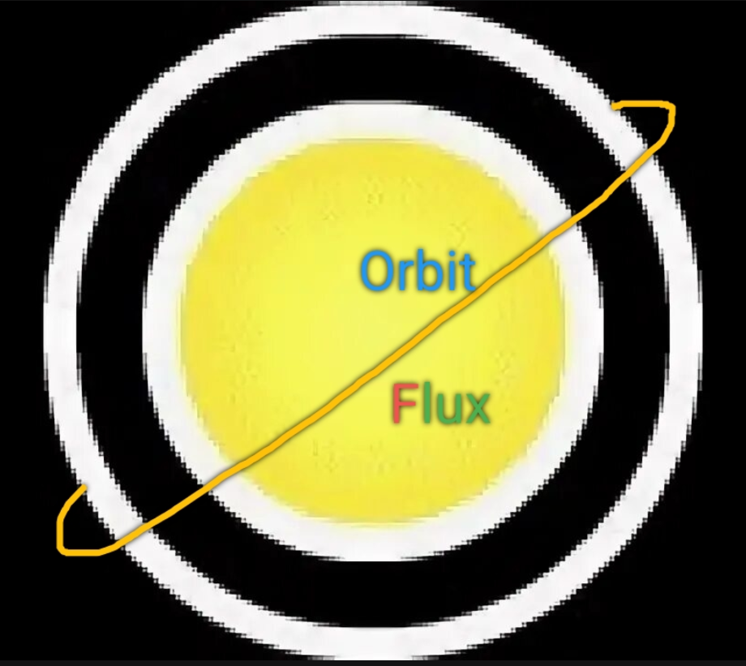

# OrbitFlux
## ​Описание

​Интерактивный физический движок на Processing. Симулирует гравитационное взаимодействие между частицами и центральной сингулярностью.
### ​Особенности
​Динамическая палитра: Цвет частиц меняется в зависимости от их кинетической энергии (скорости).

​Механика слияния: При столкновении частицы объединяются, сохраняя суммарный импульс и массу.

​Черная дыра: Невидимый объект в центре экрана, создающий искривление траекторий.

## ​Description

​An interactive physics engine built with Processing. It simulates gravitational interaction between particles and a central singularity.
### ​Features
​Dynamic Palette: Particle colors shift based on their kinetic energy (velocity).

​Merge Mechanics: Particles combine upon collision, conserving total momentum and mass.

​Black Hole: An invisible central object that warps trajectories and creates complex orbital patterns.
